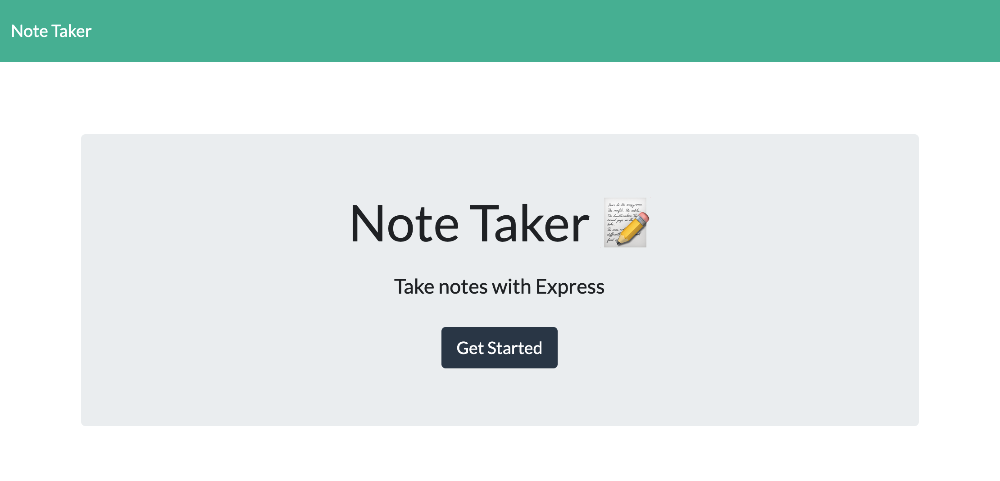
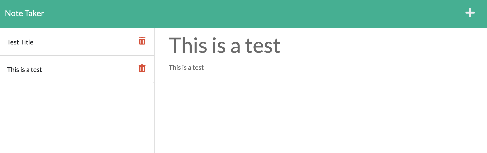

# HW11: Note Taker

  [](https://opensource.org/licenses/MIT)

  ## Description
  This project allows a small business owners to write and save their notes so that they can manage and keep track of their tasks. This application uses an Express.js back-end and allows to save and retrieve note data from JSON file. There is a unique id associated to each notes that enables the save, retrieve, and delete functionality. User is able to create a note and access later as well as delete a note whenever they need to. 

  ## Table of Contents
  * [Installation](#installation)
  * [Usage](#usage)
  * [License](#license)
  * [Contributing](#contributing)
  * [Tests](#tests)
  * [Questions](#questions)
 
  ## Installation
  Fork this repo into your GitHub. Make sure the fork process has been completed without any issue by checking all files in your forked repo. Verify wheter you have node.js installed on your desktop or not by running the command `node -v` in your terminal. If you do not have node.js installed, please go to https://coding-boot-camp.github.io/full-stack/nodejs/how-to-install-nodejs and it will walk you through the process.

  Once you completed the installation process, try to run `npm start`, it will probably give you an error BECAUSE the required dependencies are not installed yet into the root directory. Run npm install to install required dependancies (check package.json). Then, you should be able to run `npm start`. 

  If you want to run this locally, run `npm start` to start the web server. Then, open the associated localhost in your web.
  To deploy to Heroku, run `heroku create` then push to the newly created Heroku instance. Then, run `git push heroku main` to deploy your webserver.

  ## Usage

  Link to deployed URL: [https://kevin-note-taker.herokuapp.com/](https://kevin-note-taker.herokuapp.com/)

  Once you access to the website, please follow the following:
  1. Click `get started` button in the main page.
  2. You will see the page where you can save and delete your note.
  3. Click + sign to add new note. Write the title and text and then click the save button.
  4. Add as many as you want. If you want to delete your existing notes, click red trash can icon.
  5. Leave the webserver and access later again to see if your notes still exist or not.

  
  

  ## License
  This project is covered under MIT License.

  <details>
    <summary>
      See License
    </summary> 
  
  ```
  Copyright <2021> <Kevin Choi>

  Permission is hereby granted, free of charge, to any person obtaining a copy of this software and associated documentation files (the "Software"), to deal in the Software without restriction, including without limitation the rights to use, copy, modify, merge, publish, distribute, sublicense, and/or sell copies of the Software, and to permit persons to whom the Software is furnished to do so, subject to the following conditions:
  The above copyright notice and this permission notice shall be included in all copies or substantial portions of the Software.
  
  THE SOFTWARE IS PROVIDED "AS IS", WITHOUT WARRANTY OF ANY KIND, EXPRESS OR IMPLIED, INCLUDING BUT NOT LIMITED TO THE WARRANTIES OF MERCHANTABILITY, FITNESS FOR A PARTICULAR PURPOSE AND NONINFRINGEMENT. IN NO EVENT SHALL THE AUTHORS OR COPYRIGHT HOLDERS BE LIABLE FOR ANY CLAIM, DAMAGES OR OTHER LIABILITY, WHETHER IN AN ACTION OF CONTRACT, TORT OR OTHERWISE, ARISING FROM, OUT OF OR IN CONNECTION WITH THE SOFTWARE OR THE USE OR OTHER DEALINGS IN THE SOFTWARE.
  ```
  </details>
  

  ## Contributing
  No contribution will be accepted a this moment.

  ## Tests
  There are no tests available for this project.

  ## Questions
  If you have any questions, please contact me via

  * Email: [kevchoi1028@gmail.com](mailto:kevchoi1028@gmail.com)

  * GitHub: [https://github.com/rhwlffk1028](https://github.com/rhwlffk1028)

  * Linkedin: [https://linkedin.com/in/kevchoi](https://linkedin.com/in/kevchoi)